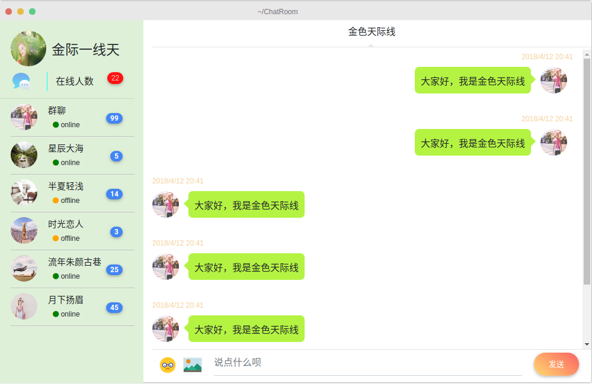

### 简易聊天室

---

**第一阶段**

使用 `html` 、`css` 、`javaScript`，搭建前端静态网页。主要使用的是一下框架：

- [`Bootstrap`](https://getbootstrap.com/)
- [`MDBootstrap`](https://mdbootstrap.com/)

其中一些的效果是利用`jquery`做出来的。

第一阶段的成果如下：

